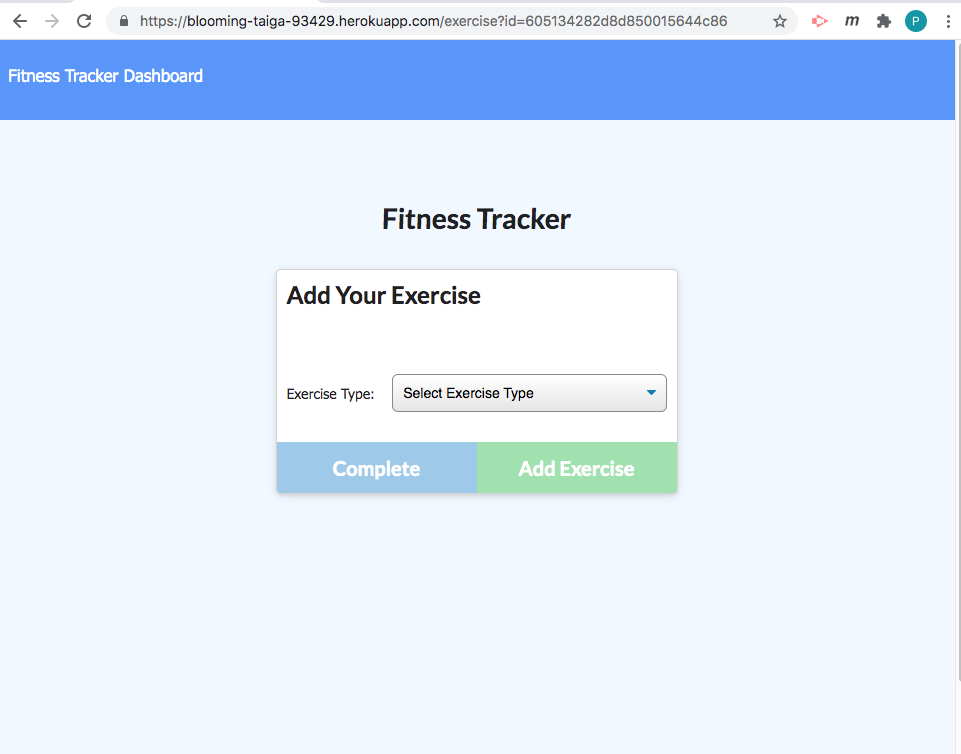
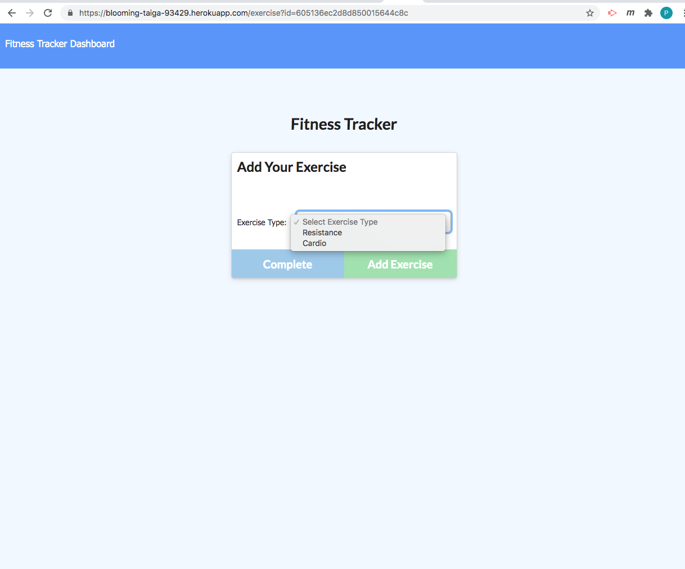
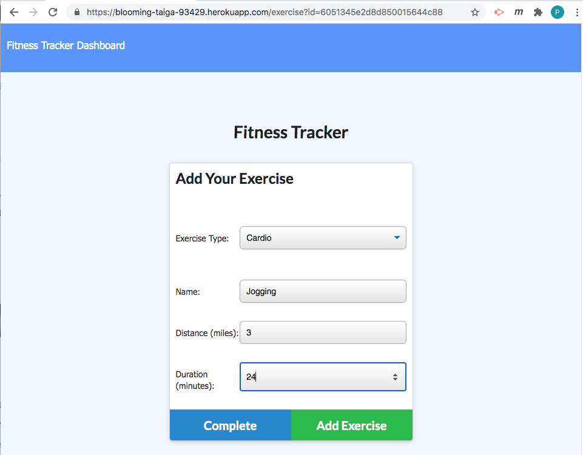
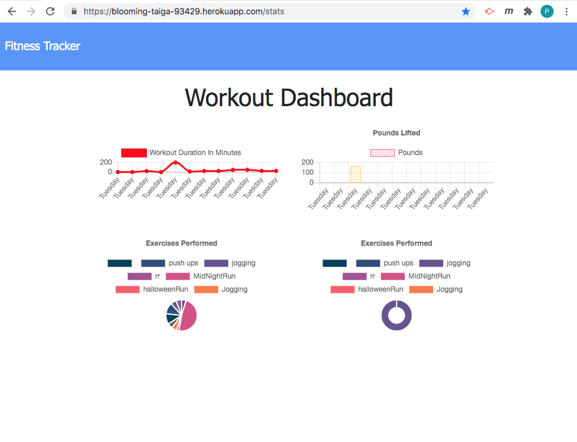
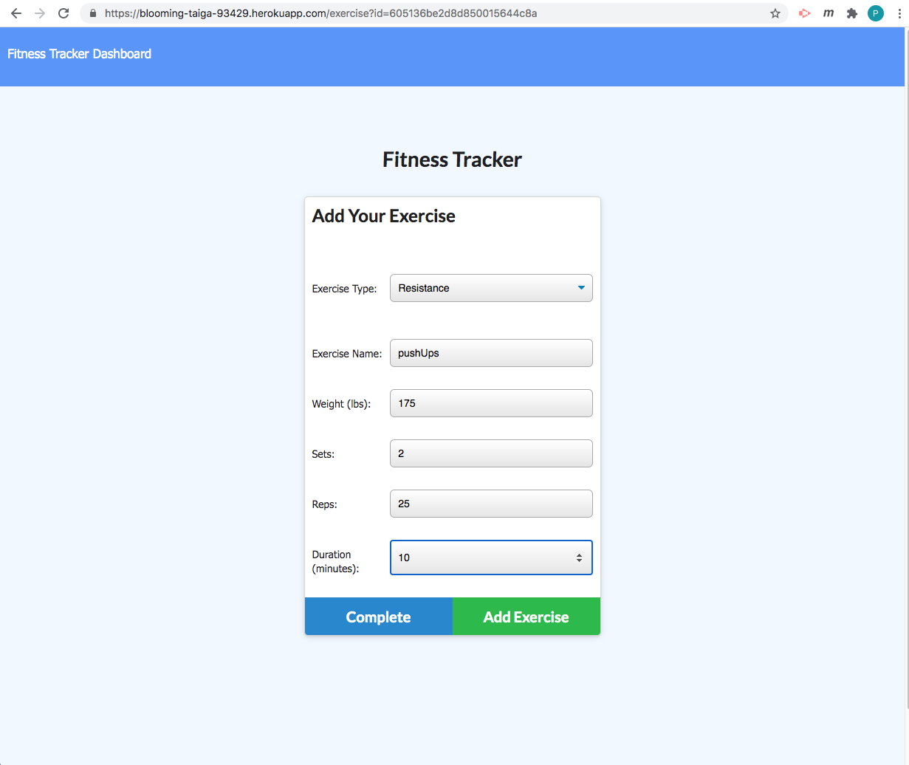
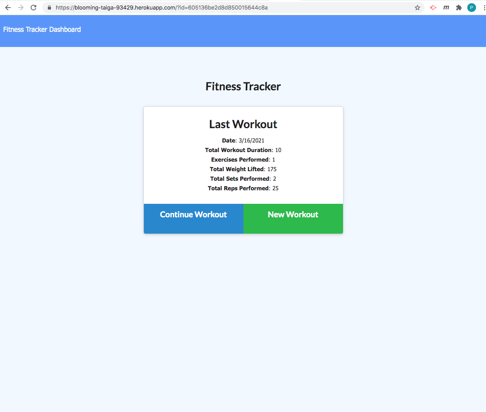
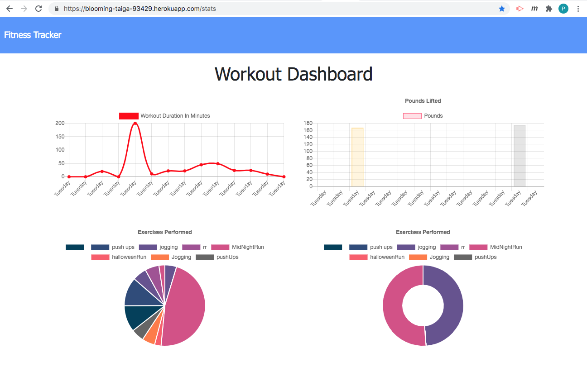

# Project Title: HW 17 Fitness Tracker
    
  ## Table of Contents:
  - [Project Description](#project-description)
  - [Installation Instructions](#installation-instructions)
  - [Project Usage Information](#project-usage-information)
  - [Contribution Guidelines](#contribution-guidelines)
  - [License Type](#license-type)
  - [Github Repo Link](#github-repo-link)
  - [HEROKU Live APP Link](https://blooming-taiga-93429.herokuapp.com/?id=60512ad42d8d850015644c81)
  - [Github Information](#github-information)
  - [my-email-for-questions-and-information](#my-email-for-questions-and-information)

  - - -
  ## Screenshot of the App running as on Heroku:
  
  ===
  ## Select Exercise Type:
  
  ===
  ## Select a Cardio Workout & enter your metrics:
  
  ===
  ## Completing the Cardio Workout, results shown
  
  ===
  ## Workout Dashboard
  
  ===
  ## Adding a Resistance Workout :
  
  ===
  ## Enter Resistance Workout Metrics:
  
  ===
  ## Completing the Resistance Workout
  
  ===
  ## Workout Dashboard
  

  &nbsp;
  - - -
  ## Project Description:
  - This is an application that allows you to add and track your workouts, for either cardio or resistance traiining.  You can add your workout metrics and get feedback on the workout as seen in the duration of your workouts and in a weekly dashboard view.  See example screenshots.

  &nbsp;
  - - -
  ## Installation Instructions:
  - The user only has to follow the Heroku Deployed Application link https://blooming-taiga-93429.herokuapp.com/?id=60512ad42d8d850015644c81  or can run the application locally from the terminal by first running >npm i to get all dependencies and then to begin the app, type:  >node server.js  and the burger app will open in the browser.

  &nbsp;
  - - -
  ## Project Usage Information:
  - To be able to create and track daily workouts.

  &nbsp;
  - - -
  ## Contribution Guidelines:
  - I made this, PAC with Streaming Turtles, LLC

  &nbsp;
  - - -
  ## License Type:
  - 

  &nbsp;
  - - -
  ## gitHub Repo Link:
  - https://github.com/streamingTurtles/17-Fitness-Tracker

  &nbsp;
  - - -
  ## HEROKU Live Application URL:
  - https://blooming-taiga-93429.herokuapp.com/?id=60512ad42d8d850015644c81

  &nbsp;
  - - -
  ## Github Information:

  
- user name: streamingTurtles
- [GitHub Profile](https://github.com/streamingTurtles)

  ## my-email-for-questions-and-information:
  - pcardillo@streamingTurtles.com  

  &nbsp;
- - -
- - -
Peter Cardillo, Columbia Engineering Fullstack Bootcamp, 2020-2021  
